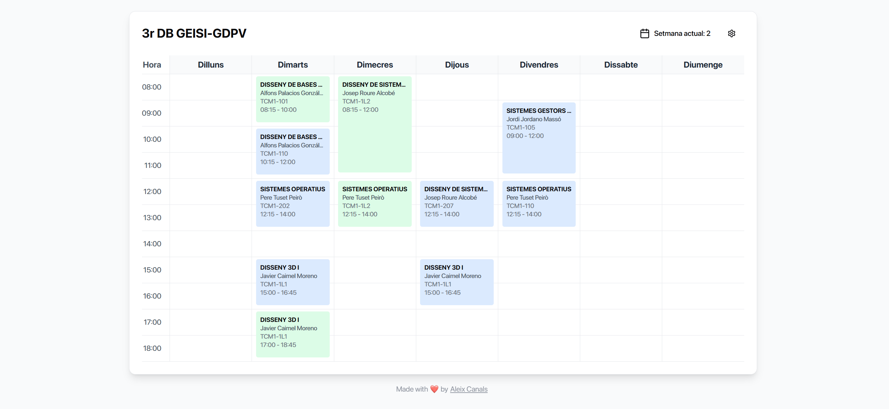

# Horari TCM

A web app for managing university class schedules.

<h5 align="center">
  <a href="https://horari-tcm-mobile.vercel.app/">Live Demo</a>
</h5>

## Features

- **Interactive Schedule Grid**: Visual weekly schedule with time slots (8:00-18:00)
- **Dual Week System**: Switch between Week 1 and Week 2 schedules
- **Class Management**: Create, edit, and delete classes with detailed information
- **Editable Fields**: Click any class to edit course code, professor, location, and times
- **Class Types**: Support for Theory and Practice classes with color coding
- **Persistent Storage**: Auto-save to browser local storage
- **Pre-made Templates**: Includes default schedules for quick setup

## Built With

- React + TypeScript
- Tailwind CSS

## Usage

Click on any day header to create a new class, or click on existing classes to edit them. Use the settings menu to switch weeks, reset the schedule, or load defaults. You can also add a new schedule in the *pre-made-schedules.ts* file.